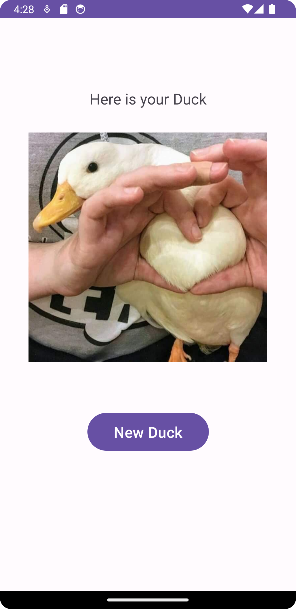
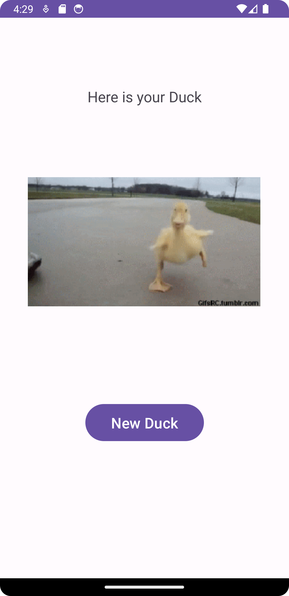
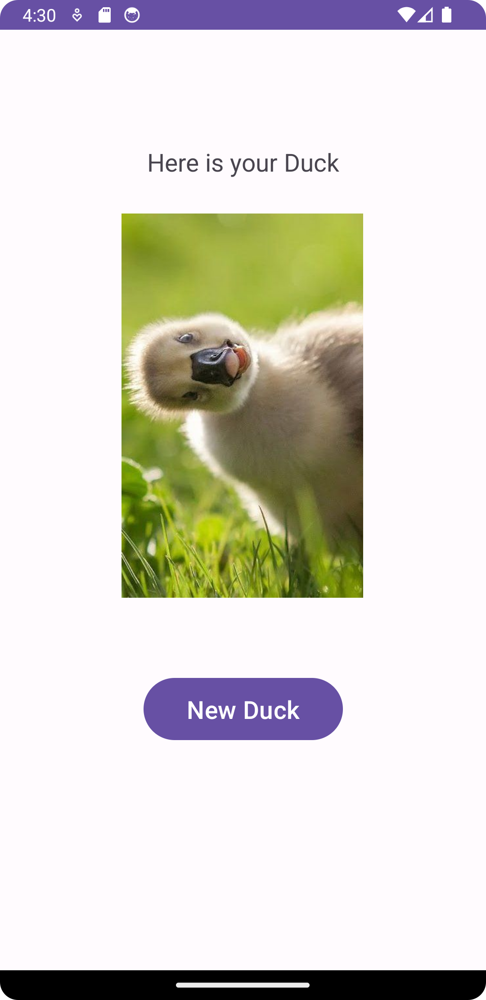

# Random Duck App

## Description

The Random Duck App is a simple Android application that displays random duck photos and gifs to the user. The app has only one screen with a "New Duck" button, which, when pressed, fetches and displays a new random duck photo or gif on the screen.

## Features

- Display random duck photos and gifs to the user on a single screen.
- Fetch new duck photos from an external API upon pressing the "New Duck" button.
- Provides a simple and intuitive user interface.

## Screenshots

  

## Getting Started

To use the Random Duck Photo App, follow these steps:

1. Clone the repository to your local machine:

```
git clone https://github.com/atakanakin/RandomDuck.git
```

2. Open the project in Android Studio.

3. Build and run the app on an Android emulator or a physical device.

## Dependencies

- Glide: [](https://github.com/bumptech/glide)

Glide is used in this project for efficient image loading and caching. It simplifies the process of loading images and gifs from various sources and displaying them in ImageViews.

To include Glide in your Android project, add the following line to the `dependencies` block in your app-level `build.gradle` file:

```gradle
implementation 'com.github.bumptech.glide:glide:4.12.0'
```

## API Endpoint

- Base URL: https://random-d.uk/

## Fetching a Random Duck Photo

To fetch a random duck photo, you need to make a GET request to the API endpoint:

- Endpoint: `/api/v2/random`

Example Request:
```
GET https://random-d.uk/api/v2/random
```

Example Response:
```json
{
    "message":"Powered by random-d.uk",
    "url":"https://random-d.uk/api/115.jpg"
}
```

The response will contain a URL that points to the random duck photo. You can use this URL to load the duck photo into your Android app using Glide or any other image loading library.

## API Terms of Use

Please refer to the official API documentation provided by the [https://random-d.uk/](https://random-d.uk/api) for more detailed information about the API and its usage.

## Bugs and Issues

If you encounter any bugs or issues while using the app, please report them in the "Issues" section of the GitHub repository.

## License

This project is licensed under the [MIT License](LICENSE).

## Contact

For any questions or inquiries, feel free to reach out to me at atakanakink@gmail.com.